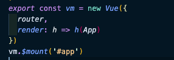

# 編集ルール
<EditMetaInfo/>


基本的な記載方法はMarkdownの記載と一緒です。
統一したい内容・特殊なルールがある箇所を中心に以下、説明します。

## タイトルのレベル

```markdown
# ページタイトル
## サブタイトル
### 項目
#### サブ項目
```

レベル4まで収める。
これ以上増える場合は可読性確保のため、分割することを進める。


## Markdown記載方法

### テーブル記法

- Exsample1:横方向の結合

|             |          Grouping           ||
| First Header |     Second Header     |  Third Header |
| ------------ | :-------------------: | ------------: |
| Content      |      *Long Cell*      |               |
| Content      |       **Cell**        |          Cell |
| New section  |         More          | `Hello World` |
| And more     | With an escaped '\\|' |               |

- Exsample2:縦方向の結合

|               col1 |  col2 |     col3 |
| -----------------: | ----: | -------: |
|        した2つ結合 | data1 |          |
|                 ^^ | data1 | 3--5 ATP |
| Pyruvaye oxidation | data1 |    5 ATP |
|        した3つ結合 | data1 |          |
|                 ^^ |       |   15 ATP |
|                 ^^ | data2 |    3 ATP |
|     **30--32** ATP |       |          |


### ラベル

記事を装飾するラベルを以下のように設定しています。
適宜、必要に応じて利用してください


!!! note Testing Notes
Good Note

ちょっとしたメモを残す
!!!

!!! abstract Course Outline
This is an abstract
章の冒頭でこの記事を読んでわかること・できるようになることをまとめるのに利用  
!!!

!!! info Information
Info icon
!!!

!!! tip Cool
This is a tip.
!!!

!!! success SUCCESS Thing
This is a success box
!!!


!!! warning A good warning
Example of a warning
!!!

!!! failure I failed
Fail in life.
!!!

!!! danger More danger
DANGEROUS
!!!

!!! bug Software Bug
I love bugs
!!!

!!! example 数式 
$$x^2=6.5*5$$
!!!


!!! quote Qutation
Quote 1.1
!!!


### 図解記法
mermaid.jsを利用して作成

```mermaid
<mermaid>
graph TD
  A[Silvester] -->|Get money| B(Go shopping)
  B --> C{Let me think}
  C -->|One| D[Laptop]
  C -->|Two| E[iPhone]
  C -->|Three| F[Car]
  C -->|Four| F[Mac]
</mermaid>
```

<mermaid>
graph TD
  A[Silvester] -->|Get money| B(Go shopping)
  B --> C{Let me think}
  C -->|One| D[Laptop]
  C -->|Two| E[iPhone]
  C -->|Three| F[Car]
  C -->|Four| F[Mac]
</mermaid>


<mermaid>
sequenceDiagram
  Alice->>Bob: Hello Bob, how are you?
  alt is sick
      Bob->>Alice: Not so good :(
  else is well
      Bob->>Alice: Feeling fresh like a daisy
  end
  opt Extra response
      Bob->>Alice: Thanks for asking
  end
</mermaid>


<mermaid>
gantt
section Section
Completed :done,    des1, 2014-01-06,2014-01-08
Active        :active,  des2, 2014-01-07, 3d
Parallel 1   :         des3, after des1, 1d
Parallel 2   :         des4, after des1, 1d
Parallel 3   :         des5, after des3, 1d
Parallel 4   :         des6, after des4, 1d
</mermaid>


#### Mermaid 8.4.3

Newer Versions of mermaid are required for these diagrams


<mermaid>
stateDiagram
  [*] --> Still
  Still --> [*]
  Still --> Moving
  Moving --> Still
  Moving --> Crash
  Crash --> [*]
</mermaid>

---


### vue独特の記法の利用

#### 計算をさせる
1+1 = {{ 1 + 1 }}

```vue
1+1 = {{ 1 + 1 }}
```

#### ループさせる
3回ループする

```vue
<span v-for="i in 3">
- {{ i }}回<br>
</span>
```

<span v-for="i in 3">
- {{ i }}回<br>
</span>


## 画像を利用

### ページごとの画像
画像はページごとにimgフォルダを作成し格納


```markdown

```


### public内を参照
public/は複数のページで利用する画像を格納する。

```html

```


## コードの取り扱い

### 表示

1-5行目をハイライトする

```ts{1-5}
export default class SortUtils {
    /**
     * 表示する特集のソート
     * 2022/07/27 特集の表示開始日で昇順ソートを廃止、FY22の8月号リリースまでと同じく並び順の昇順ソートに変更
     */
    public static specialfeatureMovieCategoriesSort(specialfeatureMovieCategories: Lesson[]) {
        specialfeatureMovieCategories.sort((a, b) =>
            ContentsManager.instance.compareNumber(a.specialFeatureMovieSortNumber ? a.specialFeatureMovieSortNumber : 0,
                b.specialFeatureMovieSortNumber ? b.specialFeatureMovieSortNumber : 0));
    }
}

```


### 参照

```
//1行目をハイライトする
<<<@/src/guide/code/SortUtils.ts{1}
```

<<<@/src/guide/code/SortUtils.ts{1}